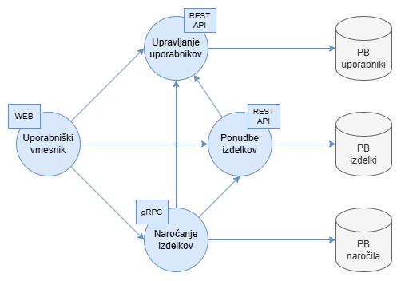

# FreshLink

## Opis
Spletna platforma, ki bo restavracijam omogočala neposreden nakup svežih, lokalnih živil od okoliških kmetov. Lokalni kmetje bodo lahko objavljali svojo ponudbo izdelkov (sadje, zelenjava, mesni izdelki, mlečni izdelki ipd.), restavracije pa bodo to ponudbo lahko pregledovale, filtrirale in naročale izdelke. Sistem bo vzpostavljen kot nabor mikrostoritev.

Cilj je ustvariti platformo, ki olajša neposreden stik med kmeti in restavracijami ter povečati uporabo lokalno pridelane hrane v restavracijah.

## Storitve

### Ponudbe izdelkov

Upravljanje ponudbe izdelkov, ki jih kmetje dodajajo.

Omogoča:

- Dodajanje novega izdelka
- Pridobitev seznama vseh izdelkov
- Filtriranje izdelkov
- Posodobitev obstoječega izdelka
- Brisanje izdelka

Komunikacija poteka preko gRPC.

### Upravljanje uporabnikov

Upravljanje s podatki o uporabnikih (kmet ali restavracija), prijava, registracija, avtorizacija.

Omogoča:

- Registracija novega kmeta ali restavracije
- Pridobitev podatkov uporabnika
- Posodobitev uporabniških podatkov
- Brisanje uporabniških računov

Komunikacija poteka preko REST API.

### Naročanje izdelkov

Upravljanje naročil, povezovanje restavracije z izbranimi izdelki ter posodabljanje statusov naročil.

Omogoča:

- Oddaja novega naročila
- Pregled posameznega naročila
- Posodobitev naročila (status: potrjeno, zavrnjeno, zaključeno)
- Preklic naročila
- Pridobitev seznama naročil za določeno restavracijo ali kmeta

Komunikacija poteka preko sporočilnega posrednika.

### Uporabniški vmesnik

Povezuje funkcionalnosti vseh mikrostoritev na enem mestu z lepo oblikovanim grafičnim vmesnikom.

Uporabniški vmesnik je spletno mesto.

## Komunikacija med storitvami

*Skica arhitekture FreshLink mikrostoritev*

Storitev za upravljanje uporabnikov <--> Storitev za ponudbe izdelkov: storitev za ponudbe izdelkov preveri ali so kmetje avtorizirani za dodajanje ali urejanje izdelkov.

Storitev za upravljanje uporabnikov <--> Storitev za naročanje izdelkov: storitev za naročanje izdelkov preveri ali so uporabniki (restavracije) avtorizirane za oddajo naročil.

Storitev za ponudbe izdelkov <--> Storitev za naročanje izdelkov: storitev za naročanje izdelkov preveri ali so izdelki razpoložljivi in opravi naročilo izdelkov (od kmeta do restavracije).

Uporabniški vmesnik <--> (Storitev za ponudbe izdelkov, storitev za upravljanje uporabnikov, storitev za naročanje izdelkov): na enostaven in uporabniku lep način omogoči funkcionalnosti omenjenih storitev.
